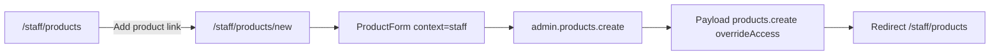

# Staff product create — vendor parity

**Date:** 2026-05-18  
**Status:** Implemented (verify manually)  
**Route:** `/staff/products` → **Add product** → `/staff/products/new`

---

## Goal

Staff (admin / BDO via `staffProcedure`) must be able to **create a full product** the same way a vendor does: dedicated page + full `ProductForm` (images, video, variants, tags, refund policy, draft/publish), not the minimal 5-field dialog.

Inline row edit on `/staff/products` stays for quick list edits (name, vendor, price, category, status). **Create** uses the vendor-grade form only.

---

## Current state (problem)

| Area | Vendor | Staff (before) |
|------|--------|----------------|
| Entry | `/vendor/products/new` — **Add Product** link | **Add product** opens `ProductFormDialog` |
| Form | `ProductForm.tsx` (~1.7k lines) | Dialog: name, vendor, price, category, status only |
| API | `vendor.products.create` — full Payload shape | `admin.products.create` — 5 fields + `statusToFlags` |
| Media | Upload image / cover / video or YouTube | None |
| Variants | Per-category `variantData`, stock, bulk generator | None |
| Publish | `isPrivate` checkbox (draft vs live) | `status` enum in dialog |

**Reference files**

- Vendor UI: `src/app/(app)/vendor/products/new/page.tsx`, `src/app/(app)/vendor/products/components/ProductForm.tsx`
- Vendor API: `src/modules/vendor/server/procedures.ts` → `products.create` (input ~L512–535, mutation ~L536–591)
- Staff list: `src/app/(app)/staff/products/components/AdminProductsTable.tsx` (button + `ProductFormDialog`)
- Staff API: `src/modules/admin/server/procedures.ts` → `products.create` (minimal `productFormSchema`)
- Collection: `src/collections/Products.ts` — fields, `beforeValidate` (string → Lexical description), `beforeChange` (vendor assign, stock → draft)

---

## Target architecture

1. **Navigation:** Replace dialog trigger with `<Link href="/staff/products/new">` (mirror vendor `Plus` + link pattern).
2. **UI:** Reuse `ProductForm` with `context="staff"` and `vendors` from `admin.vendors.listOptions`.
3. **API:** Extend `admin.products.create` to accept the **same Zod input** as `vendor.products.create`, plus required `vendor: string` (staff picks vendor; vendor flow auto-assigns from session).
4. **Processing:** Share YouTube field handling (`extractYouTubeVideoId`, `timeToSeconds`) and pass through `description`, `variants`, `cover`, `tags`, etc. into `ctx.db.create({ overrideAccess: true })`.
5. **Access:** Payload `products.create` allows vendors + super-admin only; staff mutations **must** use `overrideAccess: true` (already pattern on `admin.products.*`).

---

## Task checklist

### 1. API — `admin.products.create` (full parity)

- [x] Replace minimal `productFormSchema` on **create** with shared input (see `src/modules/products/product-create-input.ts`):
  - **Required:** `vendor`, `name`, `price`, `category`
  - **Optional:** `description`, `subcategory`, `image`, `cover[]`, `videoSource`, `video`, `youtubeUrl`, `youtubeStartTime`, `refundPolicy`, `tags[]`, `variants[]` (`variantData`, `stock`, `price?`), `isPrivate`
- [ ] Validate `vendor` exists (`ctx.db.findByID` collection `vendors`).
- [ ] Run `processProductCreateInput(input)` for YouTube (same rules as vendor).
- [ ] `ctx.db.create({ collection: 'products', data: { ...processed, vendor, isArchived: false }, overrideAccess: true })`.
- [ ] Map Payload validation errors to readable `TRPCError` messages (reuse or slim vendor `products.create` catch block).
- [ ] **Do not** remove minimal `admin.products.update` used by inline row edit (name, vendor, price, category, status) — separate code path.

### 2. Shared module (optional but recommended)

- [ ] `src/modules/products/product-create-input.ts`
  - `productCreateBodySchema` — vendor payload (no `vendor` field)
  - `staffProductCreateInputSchema` — `productCreateBodySchema.extend({ vendor: z.string().min(1) })`
  - `processProductCreateInput(input)` — YouTube ID + start seconds; clear YouTube fields when `videoSource === 'upload'`
- [ ] (Stretch) Refactor `vendor.products.create` to call shared processor — avoids drift.

### 3. UI — `ProductForm` staff mode

- [ ] Props: `context?: 'vendor' | 'staff'` (default `'vendor'`), `vendors?: { id: string; name: string }[]`
- [ ] When `context === 'staff'`:
  - Extend form schema with `vendor: z.string().min(1, 'Vendor is required')`
  - Show **Vendor** `<Select>` at top of Basic Information (before name)
  - `create` mutation → `trpc.admin.products.create` with `vendor` + full `submitData`
  - `onSuccess` → `utils.admin.products.list.invalidate()` + `router.push('/staff/products')`
- [ ] When `context === 'vendor'`: unchanged behavior (`vendor.products.create`, redirect `/vendor/products`).

### 4. Routes & list page

- [ ] Add `src/app/(app)/staff/products/new/page.tsx` — title + `<ProductForm context="staff" vendors={...} />`
- [ ] `AdminProductsTable.tsx`: **Add product** → `Link` to `/staff/products/new`; remove `ProductFormDialog` + `formOpen` state for create
- [ ] `staff/products/page.tsx`: helper text mentions “Add product” opens full create form
- [ ] Delete or deprecate `ProductFormDialog.tsx` if unused (only was create; no full edit in dialog)

### 5. Auth & roles

- [ ] `staffProcedure` in `src/trpc/init.ts` — `isAppStaff` (admin **or** BDO) — already gates `adminRouter`
- [ ] No change to Payload collection `access.create` required if all writes use `overrideAccess: true`

### 6. Manual test checklist

- [ ] Log in as staff → `/staff/products` → **Add product** → lands on `/staff/products/new`
- [ ] Select vendor, category, add image, add variant with stock, save as draft (`isPrivate` true) → appears in list as Draft
- [ ] Create published product (`isPrivate` false) → appears as Published
- [ ] YouTube video path: valid URL + optional start time → saves `youtubeVideoId` / `youtubeStartTimeSeconds`
- [ ] Upload video path: no YouTube fields on document
- [ ] Required variant fields for category → clear validation error (not generic 500)
- [ ] Inline row edit still works for name/price/status without opening full form
- [ ] Vendor flow `/vendor/products/new` unchanged

---

## Data model reference (`products` collection)

Fields written by vendor create (staff create should match):

| Field | Type | Notes |
|-------|------|--------|
| `vendor` | relationship | Staff: from form; Vendor: session |
| `name` | text | required |
| `description` | richText | Form sends string → hook converts to Lexical |
| `price` | number | min 0.01 |
| `category` | relationship | required |
| `subcategory` | relationship | optional |
| `image` | upload | media id |
| `cover` | upload[] | gallery |
| `videoSource` | select | `upload` \| `youtube` |
| `video` | upload | when upload |
| `youtubeUrl`, `youtubeVideoId`, `youtubeStartTime`, `youtubeStartTimeSeconds` | text/number | when youtube |
| `refundPolicy` | select | 30-day … no-refunds |
| `tags` | relationship[] | |
| `variants` | array | `{ variantData, stock, price? }` |
| `isPrivate` | checkbox | `true` = draft |
| `isArchived` | boolean | `false` on create |

**Status mapping (list UI only):** `published` = `!isPrivate && !isArchived`, `draft` = `isPrivate && !isArchived`, `archived` = `isArchived`.

---

## Out of scope (this todo)

- Staff **full edit** page (`/staff/products/[id]/edit`) — inline list edit + vendor form edit only for vendors today
- CSV import on staff
- Stock adjustment hooks when staff edits quantity on orders
- Phase 4 customers / dashboard / other items from previous plan

---

## Files to touch

| File | Action |
|------|--------|
| `src/modules/products/product-create-input.ts` | **New** — schema + YouTube processor |
| `src/modules/admin/server/procedures.ts` | **Update** `products.create` |
| `src/app/(app)/vendor/products/components/ProductForm.tsx` | **Update** staff context + mutations |
| `src/app/(app)/staff/products/new/page.tsx` | **New** |
| `src/app/(app)/staff/products/components/AdminProductsTable.tsx` | Link, remove dialog |
| `src/app/(app)/staff/products/components/ProductFormDialog.tsx` | **Remove** if unused |
| `docs/TODO/2026-05-18.md` | This file |
