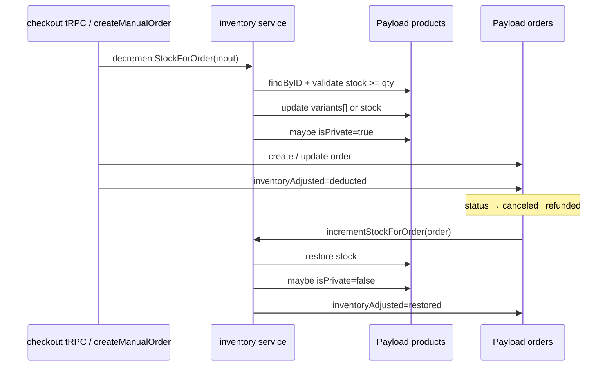

# Inventory adjustment on order place / cancel

**Date:** 2026-05-23  
**Status:** Implemented (2026-05-23) — offline checkout + manual orders + cancel/refund restore  
**Scope:** Decrement `products` stock when an order is placed; restore stock when order is `canceled` or `refunded`  
**Payment model:** **Offline only** — no Stripe checkout, webhooks, or Connect payouts in this workstream  
**Out of scope (v1):** Stripe (`src/app/api/stripe/webhook/route.ts`, Stripe branch in checkout), stock reservation (Task 9.5), audit log (Task 9.10), low-stock alerts (Task 9.8)

---

## Payment & order channels (in scope)

| Channel | Entry | `paymentMethod` | When stock should deduct (v1 proposal) |
|---------|--------|-----------------|----------------------------------------|
| Customer checkout | `checkoutRouter` → `paymentMethod: "offline"` | `offline` | On successful `orders.create` in offline branch (customer placed order) |
| Vendor / staff manual order | `createManualOrder()` | `offline` (default) or `stripe` enum legacy | Same request as order create (already decrements today) |
| Status updates | `orders.updateStatus` | — | **Restore only** on `canceled` / `refunded` — not a deduct path |

**Not in scope:** `paymentMethod: "stripe"`, `stripeCheckoutSessionId`, `POST /api/stripe/webhook`. Repo may still contain Stripe code for future use; do not wire inventory there for this TODO.

---

## Goal

Single, idempotent inventory pipeline:

1. **Order placed (confirmed)** → decrement variant or base `product.stock` by `order.quantity`.
2. **Order `canceled` / `refunded`** → increment the same SKU by `order.quantity` (once only).
3. **Zero total stock** → `products.isPrivate = true`; after restore, optionally `isPrivate = false` when total stock &gt; 0.

---

## Current state (baseline audit)

| Code path | File | Stock on create | Stock on cancel | Notes |
|-----------|------|-----------------|-----------------|-------|
| **Offline checkout** (in scope) | `src/modules/checkout/server/procedures.ts` (~L240+) | Inline variant decrement | No | `paymentMethod: "offline"`; variant match: `v.size` / `v.color` only |
| **Manual / vendor order** (in scope) | `src/modules/orders/create-manual-order.ts` | `decrementProductStock()` | No | Best variant matcher (`variantData`, `blouseSize`) |
| Admin status update | `src/modules/orders/server/procedures.ts` → `updateStatus` | No | No | Only updates `orders.status` |
| Orders collection hook | `src/collections/Orders.ts` → `afterChange` | No decrement | No | Auto-draft product when total stock = 0 after **create** |
| Stripe webhook (out of scope) | `src/app/api/stripe/webhook/route.ts` | Has inline decrement | No | **Ignore for this TODO** — not used in production |

**Reference docs:** `docs/orders/ORDER_MANAGEMENT_TASKS.md` (Tasks 9.1–9.7), `docs/categories/VARIANT_PRODUCT_INVENTORY_MANAGEMENT.md` (Scenario 4)

---

## Target architecture



**Design decisions (v1)**

| Decision | Choice |
|----------|--------|
| Trigger decrement | On `orders.create` for **offline checkout** and **manual orders** (same DB transaction: decrement → then create, or create with `inventoryAdjusted` after decrement succeeds) |
| Optional later | Deduct only when staff sets `paymentStatus: paid` / `status: payment_done` — **not** v1 unless product owner requests |
| Trigger restore | `orders.status` transitions to `canceled` or `refunded` from any other status |
| Idempotency | `orders.inventoryAdjusted` enum prevents double deduct / double restore |
| Variant resolution | Shared `findMatchingVariant()` — parity with `create-manual-order.ts` |
| Insufficient stock | `TRPCError` / throw before `orders.create` — no silent clamp to 0 |
| Central hook vs tRPC | Prefer **one** restore entry: `Orders.afterChange` **or** `updateStatus` mutation (not both without guards) |

---

## Step 1 — Inventory flow matrix (audit)

**Objective:** Document every **in-scope** `orders.create` path before refactoring.

- [ ] Enumerate call sites that create `orders` documents (**offline / manual only**):
  - [ ] `checkoutRouter` in `src/modules/checkout/server/procedures.ts` — branch `input.paymentMethod === "offline"`
  - [ ] `createManualOrder()` in `src/modules/orders/create-manual-order.ts` (vendor dialog, staff flows)
  - [ ] Any `admin` / `vendor` tRPC that creates orders (grep `collection: "orders"` + `create`)
  - [ ] ~~Stripe webhook~~ — list for reference only; mark **N/A — not used**
- [ ] Per call site, record:
  - [ ] Trigger event (tRPC mutation name + input shape)
  - [ ] Order fields populated: `product`, `quantity`, `size`, `color`, `status`, `paymentStatus`
  - [ ] Whether stock is mutated today (Y/N) and line number
  - [ ] Whether `stock >= quantity` is validated before mutate
  - [ ] Whether base `product.stock` (no variants) is handled
- [ ] Deliverable: table appended to this doc or linked PR description

**Acceptance:** No undocumented order-creation path remains.

---

## Step 2 — Domain spec & state machine

**Objective:** Freeze business rules in technical terms.

- [ ] Define **deduct** predicate (offline-only):
  - [ ] **Offline checkout:** deduct immediately before `ctx.db.create({ collection: 'orders', ... })` in offline branch; order typically `status: 'pending'`, `paymentStatus: 'pending'`, `paymentMethod: 'offline'`
  - [ ] **Manual order:** deduct in same flow as today (`createManualOrder`), before or atomically with order create
  - [ ] Confirm with product owner: if vendor never fulfills unpaid offline orders, consider moving deduct to `payment_done` in v2 (document decision here)
- [ ] Define **restore** predicate:
  - [ ] `previousDoc.status !== 'canceled' && doc.status === 'canceled'`
  - [ ] `previousDoc.status !== 'refunded' && doc.status === 'refunded'`
  - [ ] Skip if `inventoryAdjusted !== 'deducted'`
  - [ ] Skip if `inventoryAdjusted === 'restored'`
- [ ] Define **product visibility** rules:
  - [ ] After deduct: if `sum(variants[].stock) === 0` → `isPrivate: true`
  - [ ] After restore: if `sum > 0` and product was auto-drafted → `isPrivate: false` (confirm with product team)
- [ ] Document non-goals: partial cancel, line-item split orders (one order row = one product today)

**Acceptance:** State diagram reviewed; no ambiguous “when is order placed?” for each channel.

---

## Step 3 — Payload schema: order inventory flags

**Objective:** Persist deduct/restore state on the order document.

- [ ] Edit `src/collections/Orders.ts` — add field(s), e.g.:

```typescript
// Suggested shape (finalize in implementation PR)
inventoryAdjusted: {
  type: 'select',
  options: [
    { label: 'None', value: 'none' },
    { label: 'Deducted', value: 'deducted' },
    { label: 'Restored', value: 'restored' },
  ],
  defaultValue: 'none',
  admin: { readOnly: true },
}
// Optional: stockDeductedAt, stockRestoredAt (date fields)
```

- [ ] Run `npm run generate:types` → update `payload-types` usage in inventory module
- [ ] Default `none` for existing orders (migration: none required if default handles legacy rows)

**Acceptance:** Admin UI shows read-only inventory adjustment state; TypeScript includes new field.

---

## Step 4 — Shared inventory service module

**Objective:** DRY stock mutations; single variant-matching implementation.

- [ ] Create `src/lib/inventory/` (or `src/modules/inventory/server/`):

| Export | Responsibility |
|--------|----------------|
| `findMatchingVariant(product, size?, color?)` | Match `variants[]` via `variantData.size`, `variantData.blouseSize`, `v.size`, `v.color` |
| `decrementStockForOrder(db, params)` | Validate → decrement → auto-draft → return `{ previousStock, newStock }` |
| `incrementStockForOrder(db, params)` | Restore → optional un-draft → return counts |
| `getTotalVariantStock(product)` | `reduce` over `variants[].stock` |

- [ ] Input type (example):

```typescript
type StockAdjustmentInput = {
  productId: string;
  quantity: number;
  size?: string | null;
  color?: string | null;
  orderId?: string; // for logging
  overrideAccess?: boolean;
};
```

- [ ] Errors: `TRPCError` code `BAD_REQUEST` when `stock < quantity`; log when variant expected but not found
- [ ] Payload writes: `db.update({ collection: 'products', id, data: { variants } \| { stock }, overrideAccess })`
- [ ] Extract logic from `decrementProductStock` in `create-manual-order.ts` — do not duplicate in checkout offline branch

**Acceptance:** Module unit-testable in isolation; no imports from Next.js route handlers inside core functions (pass `BasePayload` only).

---

## Step 5 — Wire decrement on in-scope order-create paths

**Objective:** Every **offline** placement calls `decrementStockForOrder` once.

- [ ] **`src/modules/checkout/server/procedures.ts`** (offline branch only, ~`paymentMethod === "offline"`)
  - [ ] Replace inline `updatedVariants` block with `decrementStockForOrder`
  - [ ] Call **before** each `ctx.db.create({ collection: 'orders', ... })` in the cart loop
  - [ ] Remove `Math.max(0, stock - qty)` without validation — fail if insufficient stock
  - [ ] Handle base `product.stock` when `variants.length === 0`
  - [ ] On success: set `inventoryAdjusted: 'deducted'` on order payload
  - [ ] Do **not** change Stripe branch in this PR (or remove unreachable Stripe path in a separate cleanup PR)
- [ ] **`src/modules/orders/create-manual-order.ts`**
  - [ ] Delete local `decrementProductStock`; import shared service
  - [ ] Set `inventoryAdjusted: 'deducted'` on created order
- [ ] Transaction ordering: if decrement throws, **do not** create order document
- [ ] **Skip:** `src/app/api/stripe/webhook/route.ts`

**Acceptance:** Offline checkout + manual vendor order → `products.variants[n].stock` decreases by `orders.quantity`; `inventoryAdjusted === 'deducted'`.

---

## Step 6 — Wire restore on cancel / refund

**Objective:** Status transition restores inventory exactly once.

- [ ] Choose implementation surface (check one):
  - [ ] **Option A:** `src/collections/Orders.ts` → `hooks.afterChange` — compare `previousDoc.status` vs `doc.status`
  - [ ] **Option B:** `src/modules/orders/server/procedures.ts` → `updateStatus` — call restore after `ctx.db.update`
- [ ] Implement `incrementStockForOrder` using order snapshot fields: `product`, `quantity`, `size`, `color`
- [ ] Guard: only if `inventoryAdjusted === 'deducted'`
- [ ] After restore: `inventoryAdjusted: 'restored'`
- [ ] Apply same rules for `refunded` (Step 7 may alias to shared helper)
- [ ] Staff/admin UI: no change required if status dropdown already includes `canceled` / `refunded`

**Acceptance:** `updateStatus` to `canceled` increases stock; second cancel update is no-op for inventory.

---

## Step 7 — Refund status (admin / staff)

**Objective:** Refunds mirror cancel for stock; avoid double restore. No payment gateway webhooks.

- [ ] Restore on `status: 'refunded'` with same guards as Step 6 (staff sets status in admin UI or `updateStatus` tRPC)
- [ ] If order was `canceled` (already `restored`), transition to `refunded` must **not** restore again
- [ ] Document: refunds are **manual** (`paymentStatus` / `status` updates only)

**Acceptance:** canceled → refunded does not add stock twice.

---

## Step 8 — Idempotency & concurrency hardening

**Objective:** Safe under double-submit checkout and concurrent offline orders.

- [ ] Checkout mutation: guard against duplicate order creation for same cart/session if applicable (client disable submit button + server-side stock re-check)
- [ ] Consider optimistic check: re-read `product` immediately before `update` (document race window for v2)
- [ ] Never decrement when `inventoryAdjusted` already `deducted` on existing order row
- [ ] Logging: structured log `{ orderId, productId, quantity, size, color, action: 'deduct' \| 'restore', paymentMethod: 'offline' }`

**Acceptance:** Two rapid checkout submits cannot drive stock negative without error; documented race limitation for v1.

---

## Step 9 — Align Orders collection hook with service

**Objective:** Remove duplicate / conflicting auto-draft logic.

- [ ] Review `Orders.ts` `afterChange` block (Task 1009 — auto-draft on create)
- [ ] Either:
  - [ ] Move auto-draft into `decrementStockForOrder` only, **or**
  - [ ] Keep hook as safety net but ensure it does not double-update product
- [ ] Ensure hook does **not** decrement stock (create hook must not duplicate Step 5)

**Acceptance:** Single source of truth for `isPrivate` when stock hits 0.

---

## Step 10 — Automated tests

**Objective:** Vitest coverage for inventory service.

- [ ] Add `tests/unit/lib/inventory/adjust-product-stock.test.ts` (path TBD)
- [ ] Cases:
  - [ ] Variant product: deduct 2 from stock 10 → 8
  - [ ] Variant product: deduct when stock 1, qty 2 → throws
  - [ ] Base product (no variants): deduct / restore
  - [ ] Restore after deduct returns original level
  - [ ] `inventoryAdjusted` guards (mock order state)
  - [ ] Auto-draft when total → 0; un-draft when restore &gt; 0 (if implemented)
- [ ] Mock `BasePayload` `findByID` / `update` (pattern from `tests/unit/lib/access.test.ts`)

**Acceptance:** `npm test` passes; CI green.

---

## Step 11 — Manual QA checklist (staging)

- [ ] Variant SKU: **offline checkout** (`paymentMethod: offline`) → stock −qty → staff sets **Canceled** → stock +qty
- [ ] Manual vendor order (`CreateOrderDialog`, offline) → same
- [ ] Insufficient stock blocks offline checkout with user-visible `TRPCError` message
- [ ] Product at 0 stock hidden (`isPrivate`) → cancel order → visible again (if un-draft enabled)
- [ ] Double-click / double-submit checkout does not create two orders with double deduct (or second fails stock check)
- [ ] Mark **payment_done** on offline order does **not** deduct again (if deduct-at-create is chosen in Step 2)

**Acceptance:** Sign-off recorded in PR or this doc (date + tester).

---

## Step 12 — Documentation & task tracker sync

- [ ] Update `docs/orders/ORDER_MANAGEMENT_TASKS.md`:
  - [ ] Mark 9.6 / 9.7 complete when Steps 6–7 ship
  - [ ] Note centralized module path
- [ ] Add cross-link from `docs/categories/VARIANT_PRODUCT_INVENTORY_MANAGEMENT.md` → this file
- [ ] Optional: add `inventoryAdjusted` to admin order detail UI (read-only badge)

**Acceptance:** Docs reflect shipped behavior; no stale “restore not implemented” notes.

---

## File touch list (implementation PR)

| Action | Path |
|--------|------|
| Create | `src/lib/inventory/adjust-product-stock.ts` |
| Create | `src/lib/inventory/types.ts` (optional) |
| Modify | `src/collections/Orders.ts` |
| Modify | `src/modules/checkout/server/procedures.ts` (offline branch only) |
| Skip | `src/app/api/stripe/webhook/route.ts` (not used) |
| Modify | `src/modules/orders/create-manual-order.ts` |
| Modify | `src/modules/orders/server/procedures.ts` (if Option B for restore) |
| Create | `tests/unit/lib/inventory/adjust-product-stock.test.ts` |
| Modify | `docs/orders/ORDER_MANAGEMENT_TASKS.md` |

---

## Deferred (post-v1)

- [ ] **Task 9.5** — Stock reservation (`reservedStock` field or separate collection; TTL release)
- [ ] **Task 9.8** — Low stock threshold notifications
- [ ] **Task 9.10** — `inventory_events` audit collection (`orderId`, `delta`, `reason`, `actor`)
- [ ] MongoDB transaction / `$inc` on embedded variant array for atomic concurrency

---

## Implementation order (recommended)

1. Step 1 (audit)  
2. Step 2 (spec)  
3. Step 4 (service module)  
4. Step 3 (schema)  
5. Step 5 (decrement wiring)  
6. Step 6–7 (restore)  
7. Step 8–9 (hardening)  
8. Step 10–12 (tests + docs)

**No code changes until this TODO is approved.**
