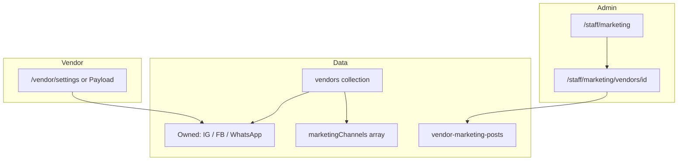

# Vendor digital marketing — social channels & admin posting

**Date:** 2026-05-25  
**Status:** Not started  
**Audience:** Super admin / BDO (staff) + vendors (self-service profile)  
**Region context:** Vendors are in **North Carolina (NC)**; marketing also happens in **local Facebook groups** and **Instagram pages** (community / niche audiences), separate from each vendor’s own business accounts.

---

## Goal

1. Store **per-vendor** links for their own channels: Instagram, Facebook page, WhatsApp group.
2. Store **NC / community marketing targets** where Evega staff post on behalf of vendors (Facebook groups, Instagram pages — can be many per vendor or shared across vendors).
3. Give **admin a workflow** to plan posts, copy product/store links, record what was posted where, and track status — without building full auto-posting to Meta/WhatsApp in v1 (manual post + log in admin).

---

## Current state

| Area | Today |
|------|--------|
| `vendors` collection | `website`, `phone`, `email`, `address` — **no** Instagram / Facebook / WhatsApp / marketing group fields |
| Staff UI | `/staff` — products, orders, customers, vendor **support** tasks (`vendor-tasks`) — **no** marketing module |
| Product URLs | `https://evega…/products/{id}`, vendor storefront `/vendors/{slug}` — usable in post copy |
| Related (future) | `docs/DETAILED_TASKS.md` — Instagram OAuth media import (separate initiative) |

**Reference files**

- `src/collections/Vendors.ts` — add fields here first
- `src/payload-types.ts` — regenerated after schema change
- Staff shell: `src/app/(app)/staff/layout.tsx`, `src/app/(app)/staff/components/AdminSidebar.tsx`
- Staff API pattern: `src/modules/admin/server/procedures.ts` + `staffProcedure`

---

## Data model (proposed)

### A. Vendor-owned channels — group `socialChannels` (vendor + admin can edit)

| Field | Type | Notes |
|-------|------|--------|
| `socialChannels.socialInstagram` | `text` | Profile or page URL (e.g. `https://instagram.com/…`) |
| `socialChannels.socialFacebook` | `text` | Facebook **page** URL |
| `socialChannels.socialWhatsAppGroup` | `text` | WhatsApp **group invite** link (`https://chat.whatsapp.com/…`) |
| `socialChannels.socialNotes` | `textarea` | Optional: posting rules, best times, vendor handle |

### B. NC / community marketing channels (vendor + admin can edit)

Repeatable array `marketingChannels[]`:

| Subfield | Type | Notes |
|----------|------|--------|
| `platform` | `select` | `facebook-group` \| `instagram-page` \| `whatsapp-group` \| `other` |
| `name` | `text` | e.g. "NC Desi Fashion Deals", "Charlotte Saree Lovers" |
| `url` | `text` | Group/page link |
| `region` | `text` | Default `NC`; optional city (Charlotte, Raleigh, …) |
| `audienceNotes` | `textarea` | Who’s in the group, posting rules, admin contact |
| `isActive` | `checkbox` | Hide retired groups |
| `lastPostedAt` | `date` | Last promotional post (vendor logs on dashboard or staff) |

### C. Marketing post log (admin workflow) — new collection `vendor-marketing-posts`

| Field | Type | Notes |
|-------|------|--------|
| `vendor` | `relationship` → `vendors` | Required |
| `product` | `relationship` → `products` | Optional — promote one SKU |
| `channels` | `array` | Which `marketingChannels[]` entries (or free-text URLs) were used |
| `caption` | `textarea` | Text admin pasted / will paste |
| `postUrl` | `text` | Link to live post if available |
| `status` | `select` | `draft` \| `scheduled` \| `posted` \| `skipped` |
| `postedAt` | `date` | When actually posted |
| `postedBy` | `relationship` → `users` | Staff user |
| `notes` | `textarea` | Results, engagement, follow-ups |

---

## Target architecture

1. **Schema** — extend `Vendors` + new `vendor-marketing-posts` collection.
2. **Payload admin** — vendors edit their own record (owned social + `marketingChannels`); staff/super-admin edit any vendor (existing `update` access on `vendors`).
3. **Staff app** — marketing dashboard: pick vendor → see channels → create post log → open links in new tabs → mark `posted`.
4. **v1 posting** — **manual** (admin copies caption + product URL, posts in FB/IG/WhatsApp); system **records** what was done.

---

## Task checklist — today (2026-05-25)

### Phase 0 — Discovery & content (no code)

- [ ] **0.1** List all active vendors; for each, collect from vendor:
  - Instagram URL
  - Facebook page URL
  - WhatsApp group invite link
- [ ] **0.2** Build NC marketing inventory spreadsheet (until fields exist):
  - Facebook group name + URL + city/region + posting rules
  - Instagram page name + URL + audience
  - Note which groups are **Evega-wide** vs **vendor-specific**
- [ ] **0.3** Define standard post template (caption + hashtags + product link + store link):
  - Product: `{BASE_URL}/products/{productId}`
  - Store: `{BASE_URL}/vendors/{slug}`
- [x] **0.4** **Decided:** vendors and staff can edit `socialChannels` + `marketingChannels` on their vendor; post **log** remains staff-only (Phase 2+).

### Phase 1 — Vendor schema (Payload)

- [x] **1.1** Add **owned channels** group `socialChannels` to `src/collections/Vendors.ts`:
  - `socialInstagram`, `socialFacebook`, `socialWhatsAppGroup`, `socialNotes`
  - Visible to vendors on their own vendor doc (no `admin.condition` lockout)
- [x] **1.2** Add **`marketingChannels`** array (NC / community targets) to `Vendors.ts`
  - **Vendor + admin** can add/edit/remove rows (same `update` access as other vendor fields, except `status` / `isActive`)
- [ ] **1.3** Run migration / backfill: seed known URLs from spreadsheet into existing vendors
- [x] **1.4** Regenerate types: `npm run generate:types`
- [ ] **1.5** Optional validation hook: URL format checks for Instagram/Facebook/WhatsApp invite links

### Phase 2 — Marketing post log collection

- [ ] **2.1** Create `src/collections/VendorMarketingPosts.ts`
- [ ] **2.2** Register in `payload.config.ts`; access: `create/read/update` staff + super-admin; vendors `read` own posts only (optional)
- [ ] **2.3** Payload admin list view: filter by vendor, status, `postedAt` date

### Phase 3 — Staff marketing UI

- [ ] **3.1** Sidebar link: **Marketing** → `/staff/marketing`
- [ ] **3.2** **List page**: vendors missing any owned channel OR missing `marketingChannels`; quick filters
- [ ] **3.3** **Vendor detail** `/staff/marketing/vendors/[vendorId]`:
  - Show owned channels (click-to-open)
  - Table of `marketingChannels` with **Open** + **Copy product link**
  - **New post** form: product picker, caption, channel multi-select, status
- [ ] **3.4** tRPC: `admin.marketing.listVendors`, `getVendorMarketing`, `createPost`, `updatePost`, `listPosts`
- [ ] **3.5** On mark `posted`: set `postedAt`, `postedBy`, update `marketingChannels[].lastPostedAt` for selected channels

### Phase 4 — Vendor self-service in storefront (optional this week)

- [x] **4.1** Vendor dashboard (`/vendor/dashboard`): edit `socialChannels` + `marketingChannels` via `DigitalMarketingForm`
- [ ] **4.2** Optional: mirror the same fields in the Next.js vendor dashboard if vendors do not use Payload admin

### Phase 5 — Operations playbook (admin daily use)

- [ ] **5.1** Weekly rotation: which vendors get posts in which NC groups (avoid spam / group rules)
- [ ] **5.2** Per-post checklist:
  1. Pick vendor + product (or store spotlight)
  2. Generate caption + links in staff UI
  3. Post to vendor WhatsApp group (if announcement to existing customers)
  4. Post to NC Facebook groups / tag Instagram pages as allowed
  5. Log post in `vendor-marketing-posts` with `status: posted`
- [ ] **5.3** Track compliance: group rules, image rights, no duplicate posts same day

### Phase 6 — Later (out of scope for today)

- [ ] Scheduled posts / calendar view
- [ ] UTM parameters on product links (`?utm_source=facebook_group&utm_campaign=…`)
- [ ] Meta Graph API auto-post (requires app review)
- [ ] WhatsApp Business API broadcasts
- [ ] Analytics: clicks per channel

---

## Admin “to-do today” (operational — until Phase 3 ships)

Use Payload `vendors` edit (after Phase 1) or spreadsheet (before Phase 1):

| # | Task | Owner |
|---|------|--------|
| 1 | Email/chat each vendor: request IG, FB page, WhatsApp group links | Admin |
| 2 | Research & join relevant **NC Facebook groups**; document rules + URLs | Admin |
| 3 | List **Instagram pages** used for NC desi/fashion/local promo | Admin |
| 4 | Pick 1–2 pilot vendors; draft 1 product post + 1 store post using template (0.3) | Admin |
| 5 | Manually post to 1 FB group + vendor WhatsApp; note engagement in notes field / spreadsheet | Admin |
| 6 | Implement Phase 1.1–1.2 in codebase (fields) so data lives in CMS | Dev |

---

## Acceptance criteria (MVP)

- [ ] Every approved vendor can have **Instagram, Facebook, WhatsApp group** stored on their record.
- [ ] Each vendor (or Evega globally) can have **multiple NC marketing channel URLs** stored.
- [ ] Admin can open `/staff/marketing`, select a vendor, **copy product URL**, log a post as `posted` with date and channels used.
- [ ] No requirement for automated posting in MVP.

---

## Files to touch (implementation)

| File | Change |
|------|--------|
| `src/collections/Vendors.ts` | Owned social fields + `marketingChannels` array |
| `src/collections/VendorMarketingPosts.ts` | New (post log) |
| `src/payload.config.ts` | Register collection |
| `src/modules/admin/server/procedures.ts` | Marketing tRPC routes |
| `src/app/(app)/staff/marketing/**` | New pages |
| `src/app/(app)/staff/components/AdminSidebar.tsx` | Nav item |
| `docs/TODO/2026-05-25-vendor-digital-marketing.md` | This file |

---

## Open questions (decide before Phase 1 merge)

1. Are **NC Facebook groups** shared across all vendors (Evega-operated list on a global config) or **per-vendor** rows only?
2. ~~Can vendors request a new group?~~ **Yes** — vendors add rows directly on `marketingChannels`.
3. Should `address.state === 'NC'` drive default `region` on channels, or manual only?
4. WhatsApp: **group invite** only, or also **business phone** for 1:1 customer contact (already have `phone` / `contactPhone`)?
