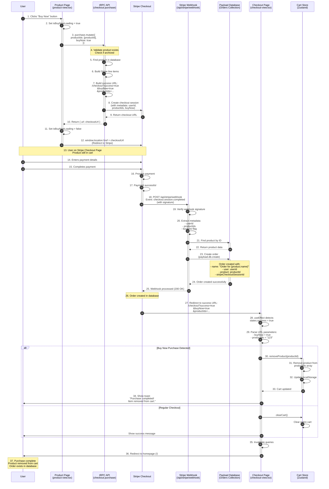
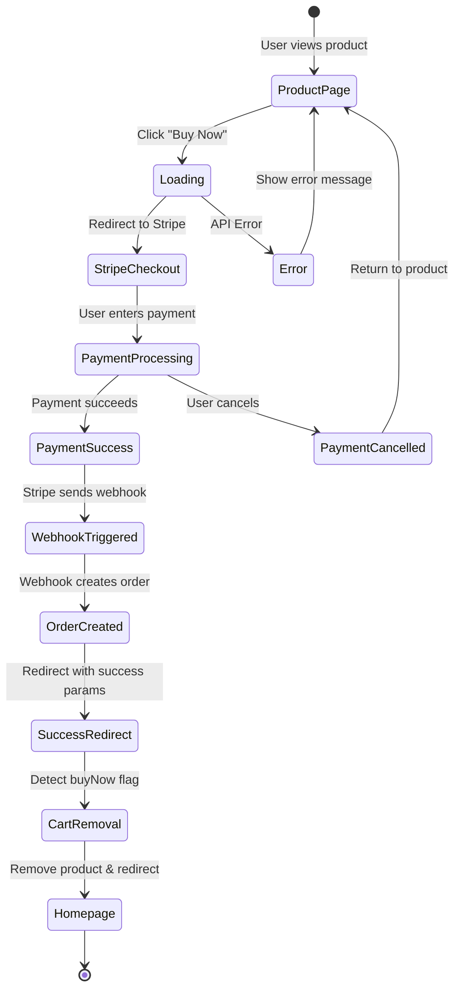
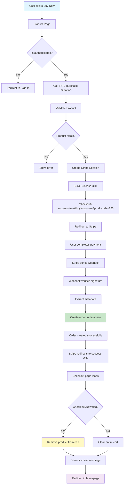
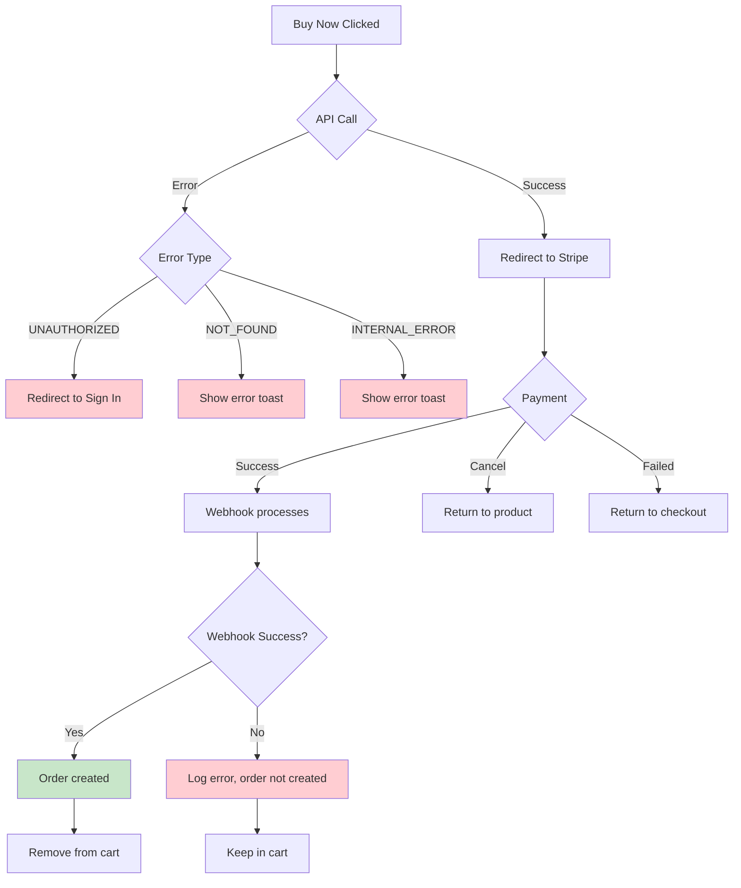
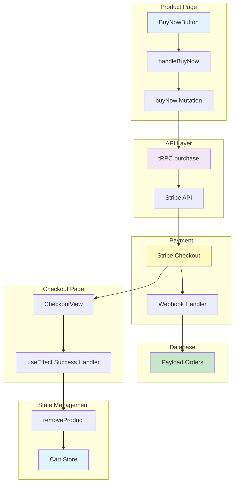

# Buy Now Feature - Process Flow Diagram

## Overview

This document illustrates the complete process flow for the "Buy Now" feature, from user interaction to order creation and cart management.

---

## Sequence Diagram - Buy Now Feature

This sequence diagram shows the complete flow of the "Buy Now" feature, from user click to order creation and cart management.



---

## Detailed Step-by-Step Flow

### Step 1: User Initiates Buy Now

```
┌─────────────┐
│    User     │
└──────┬──────┘
       │
       │ Clicks "Buy Now" button
       ▼
┌─────────────────────────┐
│   Product Page          │
│  (product-view.tsx)     │
│                         │
│  - productId: "123"    │
│  - buyNow: true        │
└──────┬──────────────────┘
       │
       │ handleBuyNow()
       │ buyNow.mutate({
       │   productIds: [productId],
       │   buyNow: true
       │ })
       ▼
```

### Step 2: API Request to tRPC

```
┌─────────────────────────┐
│   tRPC Procedure       │
│  (checkout.purchase)   │
│                         │
│  1. Validate product   │
│  2. Create Stripe      │
│     checkout session   │
│  3. Build success URL  │
│     with buyNow flag   │
└──────┬──────────────────┘
       │
       │ Success URL:
       │ /checkout?success=true
       │ &buyNow=true
       │ &productIds=123
       ▼
```

### Step 3: Stripe Checkout

```
┌─────────────────────────┐
│   Stripe Checkout      │
│                         │
│  - User enters payment │
│  - Completes payment   │
│  - Payment processed   │
└──────┬──────────────────┘
       │
       │ Payment successful
       │ Triggers webhook
       ▼
```

### Step 4: Webhook Processing

```
┌─────────────────────────┐
│   Stripe Webhook       │
│  /api/stripe/webhook   │
│                         │
│  1. Verify signature   │
│  2. Extract metadata:  │
│     - userId           │
│     - productIds       │
│     - buyNow flag      │
│  3. Create order(s)    │
└──────┬──────────────────┘
       │
       │ payload.db.create({
       │   collection: "orders",
       │   data: { ... }
       │ })
       ▼
┌─────────────────────────┐
│   Payload Database     │
│                         │
│  Order Created:        │
│  - name: "Order for..."│
│  - user: userId        │
│  - product: productId   │
│  - stripeSessionId     │
└─────────────────────────┘
```

### Step 5: Success Redirect & Cart Management

```
┌─────────────────────────┐
│   Checkout Page        │
│  (checkout-view.tsx)   │
│                         │
│  URL Params:           │
│  - success=true        │
│  - buyNow=true         │
│  - productIds=123      │
└──────┬──────────────────┘
       │
       │ useEffect detects
       │ buyNow flag
       ▼
┌─────────────────────────┐
│   Cart Store           │
│  (use-cart-store.ts)   │
│                         │
│  removeProduct(123)    │
│  → Removes from cart   │
└─────────────────────────┘
       │
       │ Redirect to /
       ▼
┌─────────────┐
│  Homepage   │
└─────────────┘
```

---

## State Flow Diagram



---

## Data Flow Diagram



---

## Key Decision Points

### 1. Authentication Check
```
User clicks "Buy Now"
    │
    ├─→ Not authenticated → Redirect to /sign-in
    │
    └─→ Authenticated → Proceed to checkout
```

### 2. Product Validation
```
tRPC receives request
    │
    ├─→ Product not found → Return error
    │
    ├─→ Product archived → Return error
    │
    └─→ Product valid → Create Stripe session
```

### 3. Payment Outcome
```
Stripe payment
    │
    ├─→ Payment succeeds → Webhook triggered
    │
    ├─→ Payment fails → Return to checkout with error
    │
    └─→ User cancels → Return to checkout with cancel=true
```

### 4. Cart Management
```
Success redirect received
    │
    ├─→ buyNow=true → Remove only purchased product
    │
    └─→ buyNow=false → Clear entire cart
```

---

## Error Handling Flow



---

## Component Interaction Diagram



---

## Timeline View

```
Time    │ Action                          │ State Change
────────┼─────────────────────────────────┼────────────────────────────
T0      │ User clicks "Buy Now"          │ isBuyNowLoading = true
T1      │ API call initiated             │ Mutation pending
T2      │ Stripe session created         │ Returns checkout URL
T3      │ Redirect to Stripe             │ isBuyNowLoading = false
T4      │ User on Stripe checkout        │ Product still in cart
T5      │ User completes payment         │ Payment processing
T6      │ Stripe sends webhook           │ Webhook received
T7      │ Order created in database      │ Order exists
T8      │ Redirect to success URL        │ URL params: buyNow=true
T9      │ Checkout page detects buyNow   │ Parses productIds
T10     │ Remove product from cart       │ Cart updated
T11     │ Redirect to homepage           │ Purchase complete
```

---

## Key URLs and Parameters

### Success URL (Buy Now)
```
/checkout?success=true&buyNow=true&productIds=69848c249fc4f3f2a7848628
```

### Success URL (Regular Checkout)
```
/checkout?success=true
```

### Cancel URL
```
/checkout?cancel=true
```

### Stripe Metadata
```json
{
  "userId": "user_123",
  "productIds": "69848c249fc4f3f2a7848628",
  "buyNow": "true"
}
```

---

## Summary

The "Buy Now" feature follows this flow:

1. **Initiation**: User clicks "Buy Now" → API call with `buyNow: true`
2. **Payment**: Redirect to Stripe → User completes payment
3. **Order Creation**: Webhook receives event → Creates order in database
4. **Cart Management**: Success redirect → Detects `buyNow` flag → Removes only purchased product
5. **Completion**: Redirect to homepage → Purchase complete

**Key Difference from Regular Checkout:**
- Regular checkout clears entire cart
- Buy Now removes only the purchased product(s)

This ensures that if a user has multiple items in their cart and uses "Buy Now" for one item, only that item is removed after successful purchase, while other items remain in the cart.
